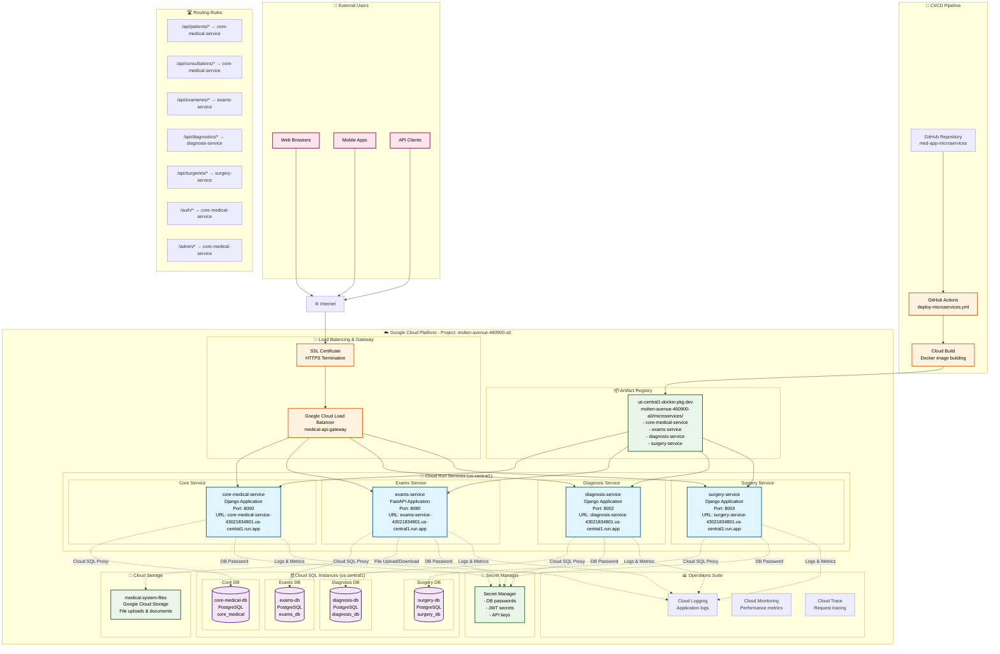

## 📋 Diagrama de Despliegue - Sistema Médico con Microservicios

### 🏗️ **Arquitectura General**
- **Plataforma**: Google Cloud Platform (GCP)
- **Proyecto**: `molten-avenue-460900-a0`
- **Región**: `us-central1`
- **Patrón**: Microservicios con Cloud Run

### 🚀 **Servicios Desplegados**

| Servicio | Tecnología | Puerto | URL | Base de Datos |
|----------|------------|--------|-----|---------------|
| **core-medical-service** | Django | 8000 | `core-medical-service-43021834801.us-central1.run.app` | core-medical-db |
| **exams-service** | FastAPI | 8080 | `exams-service-43021834801.us-central1.run.app` | exams-db |
| **diagnosis-service** | Django | 8002 | `diagnosis-service-43021834801.us-central1.run.app` | diagnosis-db |
| **surgery-service** | Django | 8003 | `surgery-service-43021834801.us-central1.run.app` | surgery-db |

### 🔀 **Enrutamiento de Tráfico**
```
Internet → Load Balancer → Servicios Específicos
```

**Reglas de Enrutamiento:**
- `/api/patients/*` → core-medical-service
- `/api/consultations/*` → core-medical-service
- `/api/examenes/*` → exams-service
- `/api/diagnostics/*` → diagnosis-service
- `/api/surgeries/*` → surgery-service
- `/auth/*` → core-medical-service
- `/admin/*` → core-medical-service

### 🗄️ **Bases de Datos**
- **Cloud SQL PostgreSQL** para cada microservicio
- **Conexión**: Cloud SQL Proxy para seguridad
- **Respaldo**: Automatizado por GCP

### 💾 **Almacenamiento**
- **Google Cloud Storage**: `medical-system-files` (archivos médicos)
- **Artifact Registry**: Imágenes Docker de los servicios

### 🔐 **Seguridad**
- **Secret Manager**: Contraseñas y claves JWT
- **HTTPS**: Terminación SSL en Load Balancer
- **IAM**: Permisos específicos por servicio

### 🔄 **CI/CD Pipeline**
1. **GitHub**: Código fuente
2. **GitHub Actions**: Automatización del despliegue
3. **Cloud Build**: Construcción de imágenes Docker
4. **Cloud Run**: Despliegue automático

### 📊 **Monitoreo**
- **Cloud Logging**: Logs centralizados
- **Cloud Monitoring**: Métricas de rendimiento
- **Health Checks**: Endpoints `/health/ready` y `/health/live`

### 🌐 **Flujo de Datos**
1. Usuario hace petición HTTP/HTTPS
2. Load Balancer enruta según path
3. Cloud Run procesa la petición
4. Servicio consulta base de datos vía Cloud SQL Proxy
5. Si es necesario, interactúa con Cloud Storage
6. Respuesta regresa al usuario

### ⚡ **Características de Escalabilidad**
- **Auto-scaling**: 0-10 instancias por servicio
- **Load Balancing**: Distribución automática de carga
- **Stateless**: Servicios sin estado para mejor escalabilidad
- **Health Checks**: Recuperación automática ante fallos
